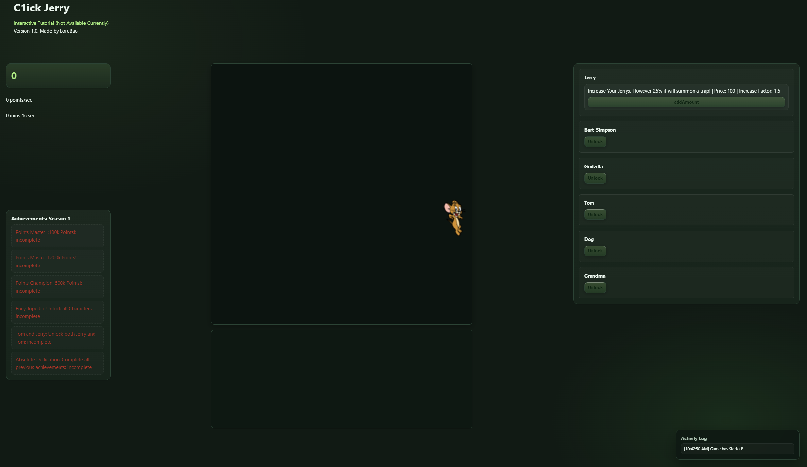

# Click a Jerry

*Slogan: For the ultimate Tom & Jerry… and others fan!*

## Table of contents

* [Intro](#Intro)
* [Quick Start](#Quick-Start)
* [Controls and UI](#Controls-and-UI)
* [Core Mechanism](#Core-Mechanism)
* [Upgrade System](#Upgrade-System)
* [Characters and Skills Explained](#Characters-and-Skills-Explained)
* [Achievement System](#Achievement-System)
* [Beginner Tutorial Flow](#Beginner-Tutorial-Flow)
* [FAQ](#FAQ)
* [Contribution and Contact](#Contribution-and-Contact)
* [License](#License)
* [Appendix](#Appendix)
* [History](#History)

---

## Intro

Welcome to **Click a Jerry**! In this game, your goal is to progress and unlock every upgrade and achievement.

**Target Audience/Players:** Users who enjoy short, fun minigames.

**Game Length:** 1–2 hours

---

## Quick Start

Your first step is to open the *Game* tab, launch your browser (Microsoft Edge recommended), and enter: [Link](https://LoreBao.github.io/Click-Game-Project) to **enter the game**.

Next, locate a Jerry. Clicking it starts the game and gives you points for every Jerry click.

Find **Upgrades/Unlock** on the right side—this is where you unlock characters and upgrades. You’ll need enough points to perform certain actions, such as upgrading *Grandma* or unlocking *Godzilla*.

You’ll find the **Achievements** tab on the left. It’s optional but satisfying to unlock achievements. In your early game (first 15–20 minutes), the easiest achievement is **Tom and Jerry**, which requires **adding a Jerry** and **unlocking a Tom**.

---

## Controls and UI

**Click**
Use the *left mouse button* to click. Clicking a Jerry grants points based on **Jerry.reward**, which increases with the number of **Toms** you own.

**Score**
Displayed at the top-left; shows your total score.

**Characters Tab**
Located on the right; manage characters with actions such as:

* **Upgrade:** Improve character attributes.
* **Unlock:** Activate the character for future use.

**Side Screen**
Below the Jerry screen. This is where **Tom** and **Dog** are displayed once unlocked.

---

## Core Mechanism

**Game Cycle**
Click a Jerry to earn points. Each click yields points , which can be increased via **Toms**.

When adding a Jerry (**Clicking `AddAmount` Jerry**), there is a **25%** chance to summon a **Trap**. Clicking a Trap will **reduce your total points by 50%**!

Jerrys **respawn/randomize position every three seconds**. There is **no limit** to how many Jerrys can be on your screen. Increase the amount via the **`AddAmount` Jerry** upgrade.

Scores can be used for:
#### Unlock
* Unlock
#### Upgrade
* `BuyBones`
* `IncreaseRange`
* `DecreaseCD`
* `AddAmount`

Audio cues play for actions such as:

* Clicking a Trap would trigger a screaming sound effect
* When a dog has no bones, the dog would bark angrily!
* When all achievements are completed, it would trigger a secret music
* When you click a Jerry, there would be a click-sound-effect.

---

## Upgrade System

#### Consumables

*Bones* are the **only** consumable in Season 1. Consumables act as fuel for certain characters, such as **Dog**.

#### Automatic

Automatic characters/upgrades grant points automatically at set intervals or rates.

**Example**

* **Dog**

#### Destroyer

Destroyers clear Jerrys either **quickly with single-target** effects or **slowly with large-area (AOE)** effects.

**Fast, Single-Target**
**Grandma** rapidly randomizes positions to try to capture a single Jerry.

**Slow, AOE**
**Godzilla** and **Bart Simpson** have longer cooldowns but can clear entire rows or even the whole map—expensive but devastating.

#### Support

A **Support** character boosts your point gain in different ways. The only Support in Season 1 is **Tom**. **Tom** increases your points per click based on how many **Toms** you own.

---

## Characters and Skills Explained

### Grandma

Automatically earns points when colliding with a Jerry while jumping around the map. Not recommended in early game due to the precision required.
**Recommended Use:** Late–end game when there are many Jerrys.

### Tom

Increases your points per click depending on how many Toms you own.
**Recommended Use:** Early–mid game when upgrades are expensive and manual clicking is your primary point source.

### Spike (Dog)

Automatically earns points for you, and the auto-gain amount is upgradable. However, **Bones** are needed to keep Dog working consistently. Purchase Bones via **Buy Bones**.
**Recommended Use:** Early–mid game when a steady point rate is needed.

### Jerry Upgrade

Increases the number of Jerrys on the map, making it easier to gain points via clicking or characters. However, each add has a **25%** chance to summon a Trap.
**Recommended Use:** Always—get it as soon as possible.

### Godzilla

Can be purchased for **700 points** and unlocked for **3,500 points**. After its **25s** cooldown, Godzilla clears an entire row of Jerrys.
**Recommended Use:** Late–end game when there are many Jerrys.

### Bart Simpson

Can be purchased for **3,000 points** and unlocked for **5,000 points**. After its **25s** cooldown, Bart Simpson clears the **entire map** of Jerrys.
**Recommended Use:** Late–end game when there are many Jerrys.

---

## Achievement System

There are many achievements to unlock. Your ultimate goal is to collect them all; each requires a different level of dedication.

* **Challenging:** **Points Series (I, II, Champion)** — requires commitment through early–mid game.

    - 100k Points for Point Series I
    - 200k Points for Point Series II
    - 500k Points for Point Series Champion

* **Beginner:** **Tom and Jerry** — only need to unlock Tom.
* **Medium:** **Encyclopedia** — less demanding than the Points Series, but requires time to unlock all characters.
* **Hardest:** **Absolute Dedication** — unlock all achievements.

---

## Beginner Tutorial Flow

### Early Game: Guide

Unlock **Tom** first for increased click power. The easiest early achievement is **Tom and Jerry** (have a Jerry—default—and unlock a Tom).

After Tom, it’s **recommended** to unlock **Dog** for strong automatic point gain. Note that **Bones** are **mandatory** to keep Dog working (purchase via **Buy Bones** once **Dog** is unlocked).

**Notes:** Unlocking **Grandma** this early isn’t recommended due to her close-range behavior being less effective with fewer Jerrys.

### Mid-Game: Guide

After unlocking **Grandma**, **Tom**, and **Dog**, work toward **Godzilla** and **Bart Simpson**—two of the most powerful characters.

* **Godzilla:** Clears an entire row of Jerrys after its cooldown.
* **Bart Simpson:** Clears all Jerrys after its cooldown.

Unlocking these two dramatically speeds up progress and farms more points.

### End-Game: Guide

After unlocking all characters, aim for the **Points Master** achievement set:

    - 100k Points for Point Series I
    - 200k Points for Point Series II
    - 500k Points for Point Series Champion

**Notes:** Use and upgrade characters strategically—for example, max **Grandma** to supercharge Jerry farming.

Other ideal achievements to pursue:

* **Encyclopedia:** Unlock all characters
* **Absolute Dedication:** Unlock all achievements

Complete these to finish the game as quickly and efficiently as possible.

---

## FAQ

### Q: Why doesn’t a Trap show up?
A: Adding/Upgrading Jerry can summon a Trap. By default, only one Jerry is shown at the start.

### Q: I bought Bart Simpson, but it didn’t show up.
A: There is a **25s** cooldown.

### Q: Why is Dog angry?
A: **Bones** are required to keep Dog running. Buy them via **Buy Bones**.

---

## Contribution and Contact
**Author:** [LoreBao]

Parts of the UI styling (CSS polish) were assisted by OpenAI’s GPT.  
All architectural decisions, game logic, and final integration were done by the author.

**Contact:** [kevin.louis.1170@gmail.com]
SPDX-FileCopyrightText: 2025 LoreBao

---

## License
This project is licensed under the MIT License. See the full text below and include it at the root of the repository as `LICENSE` (recommended).

MIT License

Copyright (c) 2025 LoreBao

Permission is hereby granted, free of charge, to any person obtaining a copy
of this software and associated documentation files (the "Software"), to deal
in the Software without restriction, including without limitation the rights
to use, copy, modify, merge, publish, distribute, sublicense, and/or sell
copies of the Software, and to permit persons to whom the Software is
furnished to do so, subject to the following conditions:

The above copyright notice and this permission notice shall be included in all
copies or substantial portions of the Software.

THE SOFTWARE IS PROVIDED "AS IS", WITHOUT WARRANTY OF ANY KIND, EXPRESS OR
IMPLIED, INCLUDING BUT NOT LIMITED TO THE WARRANTIES OF MERCHANTABILITY,
FITNESS FOR A PARTICULAR PURPOSE AND NONINFRINGEMENT. IN NO EVENT SHALL THE
AUTHORS OR COPYRIGHT HOLDERS BE LIABLE FOR ANY CLAIM, DAMAGES OR OTHER
LIABILITY, WHETHER IN AN ACTION OF CONTRACT, TORT OR OTHERWISE, ARISING FROM,
OUT OF OR IN CONNECTION WITH THE SOFTWARE OR THE USE OR OTHER DEALINGS IN THE
SOFTWARE.

---

