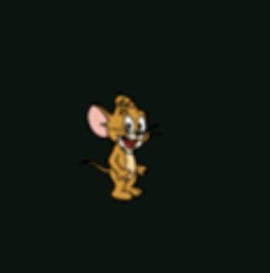
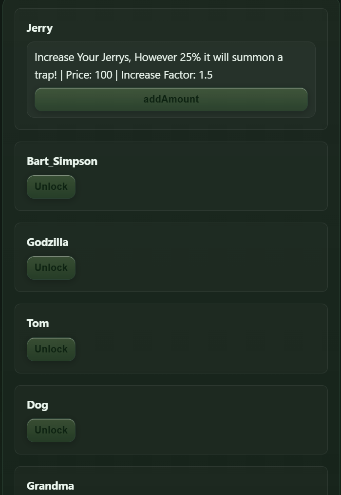
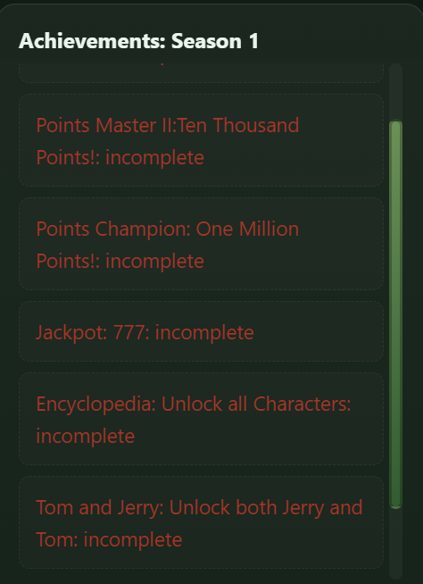
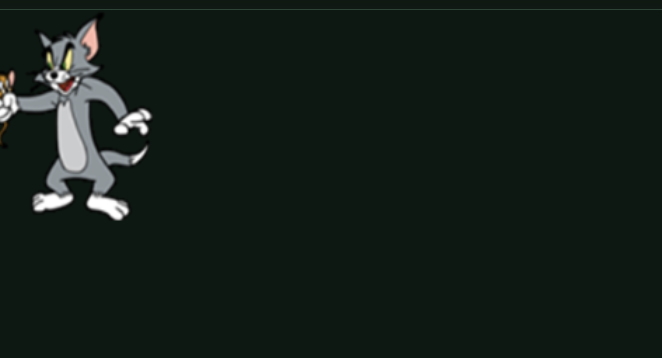

# Game Tutorial: Click a Jerry
Genre: Clicker Game, Simulation

Welcome to **Click a Jerry!** 

# Clicking a Jerry
Clicking a Jerry results in you gaining points

(This is a Jerry)

--- 
Using Points, You can **Unlock** or **Upgrade** from the existing list in the *right-side*

(Available Upgrades in *Season 1*)

---
#### Achievements
In the Game, there are many achievements waiting for you to unlock. Your goal is to collect all of them, each requiring a different level of dedication.

(Available Achievements in *Season 1*)

--- 
#### Characters / Skills
In the Game, there are many characters for you. Each having different attributes:

- **Destroyer**: Elimates Jerry Directly
    
    - *Grandma, Godzilla , Bart Simpson*

- **Automatic**: Gain Points for you without having to click a Jerry consistenly 
    
    - *Dog (Spike)*

- **Dealer**: Increase Rewards or Lower Shop Prices

    - *Tom, Jerry*

(This is a example image of **Tom**)

---

#### Characters Explained:
- Grandma
    - Action: every 25s a grandma will appear and catch Jerrys in a certain square range, after 25s, if there is no other grandmas, rest 25s.

    - Price: Ascending *2

    - Upgrade: Increase Radius and -CD

    - Max Grandmas: 1;

- Tom

    - **Action**: Tom will increase your click-power based on how much Toms you own (ex. 1 tom = + 0.5 click-power)

    - **Upgrade**: More Click-Power

    - **Price**: Ascending *2 (10)

    - **Max**: Unlimited

    

- Spike

    - **Action**: Auto gain points every certain amount of time, need to feed bone or he will be angry and not help you (buy bone from shop)

    - **Upgrade**: -time , more points , consume more bones (5 time upgrade=+1 bone);

    - **Price**: Ascending + 500 (100)

    - **Max**: Unlimited

- Jerry Upgrade
    - **Upgradable** : More Jerrys at a time and more points per click, but 25% chance it could be a mouse trap
    - **Price** : Ascending * 1.5
    - **Max** : Unlimited

- Godzilla
    - **Action** : One time use weapon, clear all the Jerrys in a *row*
    - **Price** : Ascending * 2.5
    - **Max** : Maximun 1, each Godzilla can only be used two times.

- Bart Simpson
    - **Action** : One time use weapon, clear all the Jerrys on the board
    - **Price** : Ascending * 3.2
    - **Max** : One per time.

---

### Early Game: Guide
During the early game phase of the game, one of the best characters you should unlock is **Tom** because of his trait to add your click power. 

In this phase, the easiest achievement for you to unlock would be **Tom and Jerry** which involves the user having both a Jerry (which is unlocked by default) and a Tom. 

After unlocking Tom, it is recommending to progress into unlocking **Dog** due to its overpowered ability to gain points automatically. However, mandatory purchase of bones is required in order to keep **Dog** working (Bones can be purchased via *Buy Bones* Upgrade onec **Dog** is unlocked)

**Notes:** It is not recommended to Unlock **Grandma** this early due to its close-ranged attacks that would be less effective if Jerrys are not enough

### Mid-Game: Guide
After Unlocking **Grandma**, **Tom** and **Dog**, work your way into unlocking one of the two most powerful characters: **Godzilla** and **Bart Simpson**

**Godzilla**: Clear entire row of Jerrys after it's cooldown
**Bart Simpson** Clear every Jerrys after its cooldown

Unlocking these two characters woul dramatically increase your progress speed, allowing you to farm more points 

### End-Game: Guide
After unlocking all the characters, it is ideal to move on into unlocking the *Points Master* achievement set, which includes:

- *Points Master I*: Achieve 1 Million Points
- *Points Master II*: Achieve 10 Million Points
- *Points Champion*: Achieve 1 Billion Points

**Notes:**: Use and upgrade characters strategically, such as upgrading **Grandma** to the maximum to increase Jerry farming to another level

Other Achievements are also ideal to look into, such as:

- *Encylcpedia*: Unlock All Characters
- *Absolute Dedication*: Unlock All Achievements

After finshing these, you would finish the game as quickly and efficently as possible.

Update History (v2 Tutorial)
- Created *Tutorial*