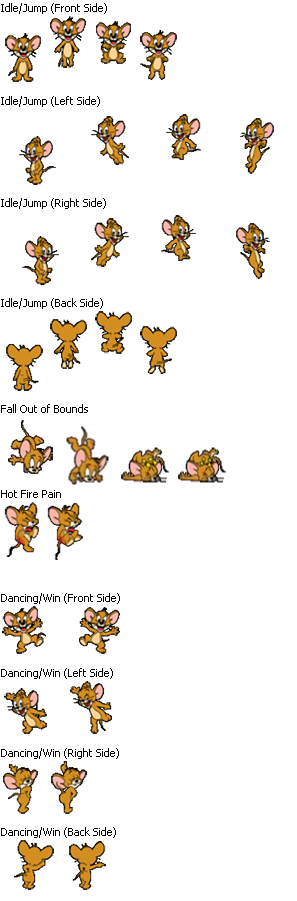

# Click-Game-Project
Click Game #Jerry

# Game Rules!

- Click Jerry to upgrade/unlock weapons to click more Jerry.

- Click The Jerry's To Obtain Points

- Using the Points, you can unlock different upgrades

- New: Unlock Achievements 

### Weapons

- **Grandma**

    - Action: every 25s a grandma will appear and catch Jerrys in a certain square range,

    - Price: Ascending *2

    - Upgrade: Increase Radius and -CD

    - Max Grandmas: 1;

- **Tom**

    - **Action**: Tom will increase your click-power based on how much Toms you own (ex. 1 tom = + 0.5 click-power)

    - **Upgrade**: More Click-Power

    - **Price**: Ascending *2 (10)

    - **Max**: Unlimited

- **Spike (Dog)**

    - **Action**: Auto gain points every certain amount of time, need to feed bone or he will be angry and not help you (buy bone from shop)

    - **Upgrade**: -time , more points , consume more bones (5 time upgrade=+1 bone);

    - **Price**: Ascending + 500 (100)

    - **Max**: Unlimited

- **Jerry Upgrade**

    - **Upgradable** : More Jerrys at a time and more points per click, but 25% chance it could be a mouse trap, 10% would summon a big Jerry and will delete all the traps!2!@!
    - **Price** : Ascending * 1.5
    - **Max** : Unlimited

- **Godzilla**
    - **Action** : One time use weapon, clear all the Jerrys in a *row*
    - **Price** : Ascending * 2.5
    - **Max** : Maximun 1, each Godzilla can only be used two times.

- **Bart Simpson**
    - **Action** : One time use weapon, clear all the Jerrys on the board
    - **Price** : Ascending * 3.2
    - **Max** : One per time.

